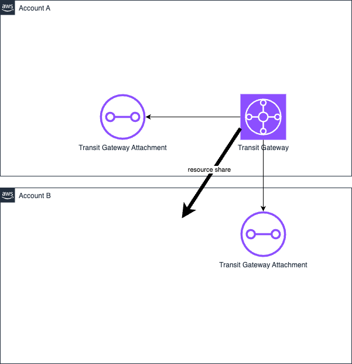

# AWSのマルチアカウントでTerraformを使うサンプルコード

以下のような構成を想定してる。

- [variableで情報を引き渡すパターン](./terraform/variables/)
- [remote stateで情報を連携するパターン](./terraform/remote-state/)
- [assume roleを使用して複数アカウントをまとめて扱うパターン](./terraform/assume-role/)
